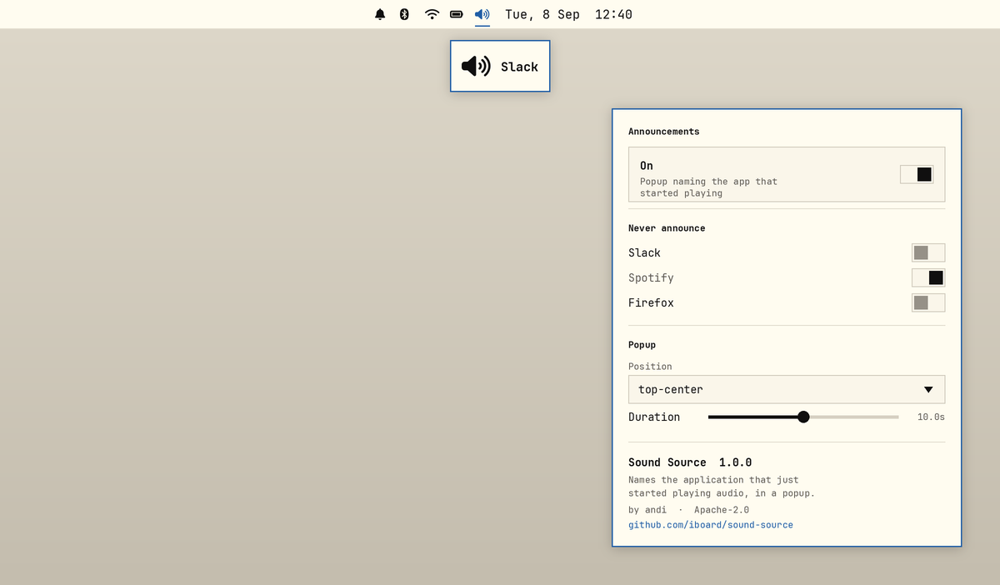

# Sound Source

An [Omarchy](https://omarchy.org/) shell plugin that names the application
which just started playing audio, in a short popup. A speaker icon on the bar
turns it on and off, and right-clicking it opens a setup dialog.

For the "something pinged and I don't know what" problem: a background app
plays a notification sound and nothing on screen says which one it was.



*Rendered mockup of the plugin's own UI, not a desktop screenshot — same
colours and controls, illustrative app names.*

## Requirements

- Omarchy 4.x (the Quickshell-based `omarchy-shell`)
- PipeWire

No other dependencies — it uses Quickshell's own
`Quickshell.Services.Pipewire`, so there is nothing to build and no helper
process to keep running.

## Install

```bash
omarchy plugin add https://github.com/iboard/sound-source.git --enable --yes
omarchy bar put io.github.iboard.sound-source --after omarchy.indicators
omarchy restart shell
```

Plugins land disabled when added without `--enable`, so you can read the code
first — which is worth doing for any plugin, since they run unsandboxed inside
`omarchy-shell`.

The second line puts the icon next to the stock indicator toggles. Put it
wherever you like with `omarchy bar put` / `omarchy bar move`; the popup works
with the icon anywhere, or with no icon at all.

## Using it

The icon on the bar:

- **left click** — announcements on/off
- **right click** — the setup dialog

The dialog covers everything:

- **Announcements** — the same on/off switch as the icon.
- **Never announce** — one switch per app. Ticking one stops that app raising
  popups.
- **Popup** — where the popup appears, and how long it stays before it is
  removed.
- **About** — read out of `manifest.json`.

The app list is every app the plugin has *seen play* since the shell started,
not just what is playing right now: the app you want silenced has usually
stopped making its noise by the time you go looking for it. Ignored apps stay
in the list, so an entry can always be taken back off.

Everything is also reachable over IPC, for keybindings or the Omarchy menu:

```bash
omarchy-shell sound-source now              # popup listing what is playing right now
omarchy-shell sound-source list             # same list on stdout, one per line
omarchy-shell sound-source last             # the app announced most recently
omarchy-shell sound-source toggle           # same switch as the bar icon
omarchy-shell sound-source state            # muted | unmuted
omarchy-shell sound-source setup            # open the setup dialog
omarchy-shell sound-source apps             # every app seen since the shell started
omarchy-shell sound-source ignored          # the current ignore list
omarchy-shell sound-source ignoreApp Slack  # add/remove one app from that list
```

## Settings

The dialog writes these, and so can you. Omarchy keeps a plugin's inline
settings in one place: its bar layout entry while the icon is on the bar,
otherwise its `plugins[]` entry in `~/.config/omarchy/shell.json`. Both are
read, so moving the icon on or off the bar does not reset anything.

```bash
omarchy bar set io.github.iboard.sound-source position center
omarchy bar set io.github.iboard.sound-source duration 4000 --json
```

| Key | Default | Meaning |
|---|---|---|
| `position` | `top-center` | `top-center`, `center`, `top-right`, `bottom-center`. Anything else falls back to `center` |
| `duration` | `2000` | How long the popup stays before it is removed, in ms |
| `muted` | `false` | Set by the bar icon. `true` suppresses announcements |
| `ignore` | `[]` | App names that must not raise a popup. The dialog writes whole names; a hand-written entry is substring matched, case-insensitively, against the node name and the app name |
| `repeatMs` | `1500` | Suppress the same app again within this window, so a browser opening three streams at once pops up once |
| `showRole` | `false` | Append PipeWire's `media.role` (`Music`, `Notification`, `Game`, …) |
| `startupGraceMs` | `2500` | Streams already playing when the shell loads are recorded silently, not announced |
| `labels` | `{}` | Rename a raw stream name to something friendlier, e.g. `{"quickshell": "Omarchy shell"}` |

Settings hot-reload. Changes to the plugin's `.qml` do not — see
[Development](#development).

## How it works

| File | Kind | |
|---|---|---|
| `Service.qml` | `service` | Watches PipeWire, decides what to announce |
| `SoundPopup.qml` | `panel` | The popup card |
| `BarWidget.qml` | `bar-widget` | The bar icon and the setup dialog |
| `SoundSource.js` | — | Pure classification logic, no QML imports |
| `test.js` | — | Unit tests over that logic |

### Detection

When a new **playback stream** appears in the PipeWire graph, the plugin reads
the stream's app name and shows it.

New streams, rather than audio levels, because that is the shape a discrete
sound has: apps open a fresh playback stream, play the sound, and close it
again. A single system sound appears as one new node and disappears when it
finishes.

Streams that are plumbing rather than an application are skipped:

- anything tagged `media.role=DSP` — this is what Omarchy's parametric EQ
  publishes, and without the filter every sound would pop up twice, once for
  the app and once for the EQ re-publishing it
- node names starting `output.omarchy.` / `input.omarchy.` /
  `omarchy_speaker_tuning`

`media.role` also picks the glyph: a music note for `Music`/`Video`/`Game`,
otherwise the same speaker glyph the bar uses.

That structural filter (`isPlumbing`) is deliberately separate from the user's
ignore list (`isIgnored`). Folding them together would hide ignored apps from
the plugin's own view of what is playing, and then nothing could ever be
un-ignored from the dialog.

### Three entry points, not one

The split is not cosmetic. A `service` is created into the shell's non-visual
host (`Item { visible: false }`), and a `Window` nested under an invisible
`Item` inherits that invisibility — a `PanelWindow` declared in `Service.qml`
maps but never draws. Panels are mounted by the shell's own Loader, so the
card lives in `SoundPopup.qml` and the service summons it.

Declaring `panel` alongside `bar-widget` also matters: `shell.summon()` routes
a plugin that is *only* a bar widget to `summonBarWidget`, which would never
reach the popup.

### Why not omarchy.osd

Reusing the shell's OSD would have been less code, but that OSD is shared with
volume, brightness and media and is anchored bottom-centre — repositioning
this popup by moving it would move all of them. `SoundPopup.qml` draws its own
surface using the same tokens and border spec, so it still matches the theme.

It also maps one surface **per monitor** (`Variants` over
`Quickshell.screens`), where the OSD maps a single window and lands on
whichever screen Quickshell picks first. Fine for a volume readout you asked
for; wrong for a popup whose whole job is to be noticed.

The card is placed with explicit `x`/`y` rather than anchors: an anchor left
over from a previous position would fight the new one, and QML resolves that
by warning and ignoring rather than by moving the card.

Its layer-shell namespace is the plugin id, so Hyprland rules can target it:

```
layerrule = blur, io.github.iboard.sound-source
```

### The bar icon

A plain `BarIconButton`, not the `BarIndicator` the stock toggles use. A
`BarIndicator` hides itself while inactive unless the indicator area is
hovered — right for a status light, wrong for a switch: once off there would
be nothing left to click to turn it back on. So this one stays drawn and just
dims, showing a muted speaker when off.

The icon reflects `muted` as read back from `shell.json`, not a local copy, so
it survives a restart and stays correct if the value is edited by hand.

## Limitations

An app that holds **one long-lived stream open** and plays its sounds through
that stream produces no new node, so nothing is announced. Music players
behave this way, which is harmless — you know you started the music — but a
chat app that keeps a permanently open output stream would slip through.

Catching that needs level watching instead: a `PwNodePeakMonitor` per stream,
announcing when one goes from silent to loud. That is a standing cost — a
monitor running on every stream for as long as the shell is up — so it is
deliberately left out rather than shipped and disabled.

A sound played *for* an app by a notification daemon is attributed to whoever
opened the stream, not to the app the notification came from. Omarchy's
notification service plays no sounds, so this does not usually arise.

## Development

The classification logic lives in `SoundSource.js` with no QML imports, so it
runs standalone:

```bash
node test.js
```

After changing any `.qml`, restart the shell rather than rescanning:

```bash
omarchy restart shell
```

`omarchy-shell shell rescanPlugins` is not enough. Qt caches the compiled
component per URL, so a changed `.qml` can keep running the old code — and a
panel that failed to load once keeps reporting a stale, misleading
`File name case mismatch` on every rescan even after the file is fine.

A restart resets the service, and `startupGraceMs` then suppresses
announcements briefly: a sound played immediately after a restart is
deliberately silent, not broken.

If you develop from a directory outside `~/.config/omarchy/plugins/` and
symlink it in, note that edits will not hot-reload either way — the shell
watches the plugin path with `inotifywait -r`, which does not descend through
a symlink.

## License

Apache License 2.0 — see [LICENSE](LICENSE) and [NOTICE](NOTICE).
